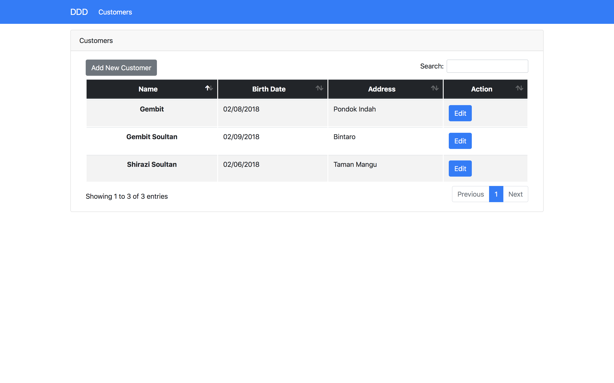

## Domain Driven Design

 This is an example of Domain Driven Design (DDD) in laravel

## Installation
git clone https://github.com/gsoultan/DDD-Laravel.git
php artisan migrate
php artisan serve

## Example

